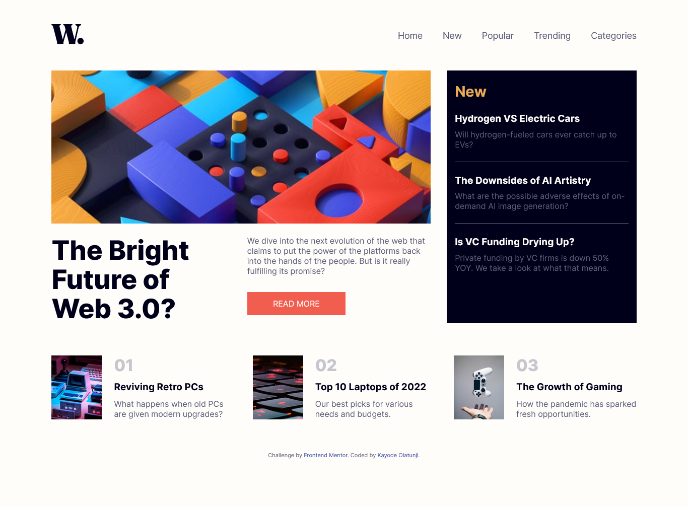

# Frontend Mentor - News homepage solution

This is a solution to the [News homepage challenge on Frontend Mentor](https://www.frontendmentor.io/challenges/news-homepage-H6SWTa1MFl). Frontend Mentor challenges help you improve your coding skills by building realistic projects. 

## Table of contents

- [Overview](#overview)
  - [The challenge](#the-challenge)
  - [Screenshot](#screenshot)
  - [Links](#links)
- [My process](#my-process)
  - [Built with](#built-with)
  - [What I learned](#what-i-learned)
  - [Useful resources](#useful-resources)
- [Author](#author)

**Note: Delete this note and update the table of contents based on what sections you keep.**

## Overview

### The challenge

Users should be able to:

- View the optimal layout for the interface depending on their device's screen size
- See hover and focus states for all interactive elements on the page

### Screenshot

### Links

- Solution URL: [Add solution URL here](https://www.frontendmentor.io/solutions/responsive-news-homepage-using-css-grid-sassscss-cPbEWcZ85C#comment-641c2b7b5174143fdb39c22d)
- Live Site URL: [Add live site URL here](https://olakad13.github.io/news_homepage/)

## My process

### Built with

- Semantic HTML5 markup
- CSS custom properties
- Flexbox
- CSS Grid
- SASS
- Vanilla JS
- Mobile-first workflow

### What I learned

I learnt how to use Css grid to build a fully responsive Webpag. I also learnt How to use the Mobile-first 
workflow approach

### Useful resources
The Scrimba's frontend career development path on www.scrimba.com helped me properly understand css grid and 
other relevant topics like css Animations, vanillas Js which was fundamental to the success of this project

## Author

- Name - [Kayode Olatunji]
- Frontend Mentor - [@olakad13](https://www.frontendmentor.io/profile/olakad13)

